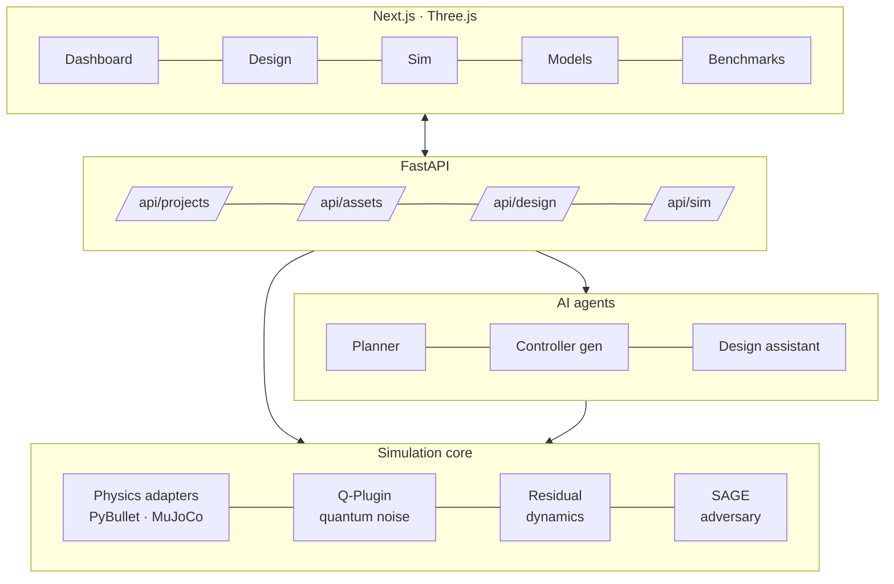

<div align="center">

# QERS · Quantum-Enhanced Robotics Simulator

**A robotics simulator that narrows the stochastic reality gap - classical macro-physics + a quantum-stochastic / adversarial / residual-learning micro layer, driven by an NLP "text → algorithm" workflow.**

<br/>


</div>

---

## TL;DR

> **Reinvent noise, not gravity.**

Macro-physics is solved. Real-world **stochasticity** isn't. QERS layers a quantum-noise plugin, a Bayesian sandbox, a SAGE adversary, and residual dynamics on top of standard physics engines - then lets you drive the whole thing from **NLP specs**.

---

## Key differentiators

- **Reinvent noise, not gravity** - build on PyBullet/MuJoCo, overlay Q-Plugin quantum noise + Bayesian sandbox + SAGE adversary + residual dynamics
- **POMDP-based gap metrics** - G_dyn, G_perc, G_perf
- **Design mode** - Mesh import → segmentation → linkage → URDF export via NLP
- **AI text → algorithm** - NLP spec → structured task JSON → planner → controller skeleton
- **Model registry** - HuggingFace models (VLA, policies, perception, planners)
- **Reality profiles** - configurable physics + sensor + actuation profiles

---

## Architecture



---

## Repo layout

```
.cursor/rules/       Cursor rule files (.mdc)
contracts/           Versioned schemas
docs/                architecture · api · evaluation · design mode · AI workflow
apps/
  sim/               Simulation core - physics adapters, Q-Plugin, residual, adversary
  api/               FastAPI - /api/projects, /api/assets, /api/design, /api/sim
  web/               Next.js - Dashboard, Design, Sim, Models, Benchmarks (Three.js viewport)
  agents/            AI agents - planner, controller generator, design assistant
tools/
  llm_research/      Multi-LLM provider, caching, prompts
  benchmarks/        G_dyn, G_perc, G_perf computation
examples/            Demo URDFs, environments, reality profiles
runs/                Run outputs (created at runtime)
```

---

## Quick start

> Run everything from the repo root (where `Makefile` and `apps/` live).

```bash
python3 -m venv .venv
source .venv/bin/activate
make setup
```

Then, in two terminals (repo root, venv active):

```bash
# Terminal 1
make backend

# Terminal 2
make ui
```

Optional - example sim:

```bash
make demo
```

Open http://localhost:3000 → loads example robot → runs sim → shows metrics + logs.

### Platform notes

- **Multi-line paste into zsh** - run one command per line to avoid parse errors. Use `make setup` for a single install step. The UI step uses `pnpm` if available, else `npm` (Node.js must be installed).
- **Python 3.13 / macOS** - core install works without PyBullet or open3d. The sim uses **stub physics** when PyBullet isn't installed. For real physics: `pip install -r requirements-optional.txt` (pybullet may fail to build from source on macOS; use Docker or Python 3.11/3.12). No open3d 3.13 wheel yet.

### Docker (optional)

Not required for local dev. If Docker Desktop is installed, see the platform section of the docs for compose targets.

---

<div align="center">
<sub>Part of <a href="https://github.com/pbathuri">@pbathuri</a>'s <a href="https://github.com/pbathuri/Map_Projects_MAC">project portfolio</a> - robotics line.</sub>
</div>
